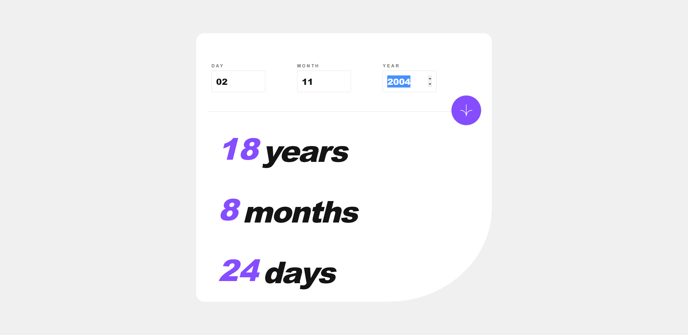
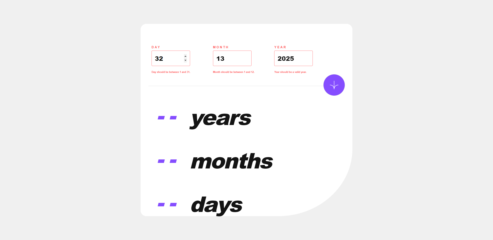

# Age Calculator App - Frontend Mentor Solution

This is a solution to the [Age calculator app challenge on Frontend Mentor](https://www.frontendmentor.io/challenges/age-calculator-app-dF9DFFpj-Q). Frontend Mentor challenges help you improve your coding skills by building realistic projects.

## Overview

### The Challenge

Users should be able to:

- View an age in years, months, and days after submitting a valid date through the form
- Receive validation errors if:
  - Any field is empty when the form is submitted
  - The day number is not between 1-31
  - The month number is not between 1-12
  - The year is in the future
  - The date is invalid e.g. 31/04/1991 (there are 30 days in April)
- View the optimal layout for the interface depending on their device's screen size
- See hover and focus states for all interactive elements on the page
- **Bonus**: See the age numbers animate to their final number when the form is submitted

### Screenshot
#### Desktop View


#### Success State


#### Error States



### Links

- Solution URL: [Link to the solution on Frontend Mentor](https://www.frontendmentor.io/solutions/age-calculator-app-using-react-and-sass-Br7dnv-vfB)
- Live Site URL: [Link to the live site](https://age-calculator-app-botir.netlify.app/)

## My Process

### Built With

- Semantic HTML5 markup
- CSS custom properties
- Flexbox
- CSS Grid
- Mobile-first workflow
- [React](https://reactjs.org/) - JavaScript library
- [Styled Components](https://styled-components.com/) - For styles

### Age Calculation Function

The age calculation function takes the input day, month, and year, and calculates the age based on the provided date of birth. The function handles scenarios where the birth date is before the current date and correctly adjusts the age for months and days.

```javascript
export default function calculateAge(day, month, year) {
    const dob = new Date(year, month - 1, day); // because month is 0-based in JavaScript date
    const today = new Date();
  
    let ageYear = today.getFullYear() - dob.getFullYear();
    let ageMonth = today.getMonth() - dob.getMonth();
    let ageDay = today.getDate() - dob.getDate();
  
    // handle if today's month or day is less than dob's month or day
    if (ageMonth < 0 || (ageMonth === 0 && ageDay < 0)) {
      ageYear--;
      ageMonth += (ageMonth < 0) ? 12 : 0;
  
      const lastDayOfMonth = new Date(today.getFullYear(), today.getMonth(), 0).getDate();
      ageDay += (ageDay < 0) ? lastDayOfMonth : 0;
    }
  
    return {
      years: ageYear,
      months: ageMonth,
      days: ageDay
    };
  }
  ```

### Continued Development
In future projects, I would like to focus on improving my form validation techniques and incorporating animations to enhance the user experience further. Additionally, I will continue to explore and utilize various CSS methodologies and frameworks to create more efficient and maintainable styles for my projects.

### Useful Resources
MDN Web Docs - A comprehensive web development reference guide that I frequently used for JavaScript and HTML/CSS information.
Styled Components Documentation - This documentation helped me understand how to use styled components efficiently to style my React components.
Author: @botirk38
Frontend Mentor - @botirk38
### Acknowledgments
I would like to thank the Frontend Mentor community for providing this challenge and allowing me to practice and improve my frontend development skills. Special thanks to [name of any individuals or resources that provided inspiration or assistance]. Your support was invaluable during the development of this project.


